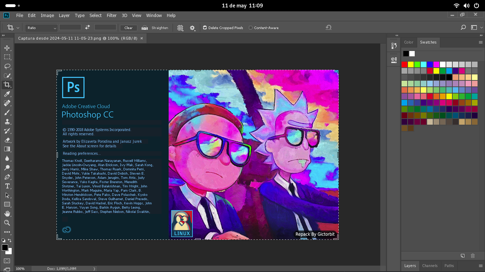
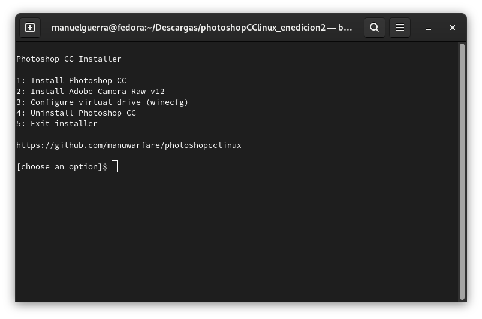

<div align="center" class="tip" markdown="1" style>



    <br/>
  
</div>

# Photoshop CC v19 installer for Linux
This bash script helps you to install Photoshop CC version 19 on your Linux machine using Wine behind the scene
and sets some necessary components up for the best performance

## :rocket: Features
* downloads necessary components and installs them (`vcrun`, `atmlib`, `msxml`...)
* downloads `photoshop.exe` installer
* creates photoshop command and a desktop entry
* wine dark mode
* supports graphic cards like (`intel`, `Nvidia`, `AMD`)
* saves the downloaded files in your cache directory
* It's free and you will not need any license key
* works on any Linux distribution

## :warning: Requirements
1- Use a 64bit edition of your distro

2- Make sure the following packages are already installed on your Linux distro
* `wine`
* `wine64`
* `winetricks`
* `wget`
* `md5sum`


If they are not already installed you can install them using your package manager for example in Fedora Linux
```bash
sudo dnf -y install wine winetricks wget
``` 
3- Make sure you have enough storage in your `/home` partition about `5 GiB`
> 1 GiB will be free after installation

Also you can install photoshop in diffrent directory

4- Make sure you have an internet connection and about 1.5 Gib traffic to download photoshop and its components

## :computer: Installation

The installer scripts use a virtual drive of wine and makes a new `winprefix` for Photoshop

First of all, you need to clone the repository with this command:
```bash
cd $(xdg-user-dir DOWNLOAD) && git clone https://github.com/manuwarfare/photoshopCClinux.git && cd photoshopCClinux
```
Then you can easily run `setup.sh` script to install photoshop cc on your Linux distro

```bash
chmod +x setup.sh && ./setup.sh
```


During installation please pay attention to the script messages

> **NOTE :** make sure OS version in wine is on windows 7

Installer script use `winetricks` to install necessary components

## :computer: Installation options

You can use `-d` to specify the installation path, and `-c` for the cache directory.
for example:
```bash
./PhotoshopSetup.sh -d /mnt/myfiles/photoshop
```
or
```bash
./PhotoshopSetup.sh -d /mnt/myfiles/photoshop -c /mnt/cache
```
When no options are given, the installer script will use the default path, 
the uninstaller script and others will detect your custom path so there is no problem,
I recommend using the `-d` option  and having the default cache directory.
this feature is currently being tested, and will be added to `setup.sh` later

## :wine_glass: wineprefix Configuration
If you need to configure the wineprefix of photoshop you can use `winecfg.sh` script just run the command below
```bash
chmod +x winecfg.sh
./winecfg.sh
```
## :hammer: Tools

<details>
<summary>:sparkles: Liquify Tools</summary>
As you know photoshop has many useful tools like `Liquify Tools`.</br>

If you get some errors while working with these tools,
It may because of the graphics card.</br>

Photoshop uses the `GPU` to process these tools so before using these tools make sure that your graphics card `(Nvidia, AMD)` is configured correctly in your Linux machine.
</br>The other solution is you can configure photoshop to use your `CPU` for image processing. to do that, follow the steps below:

* Go to edit tab and open `preferences` or `[ctrl+K]`
* Then go to the `performance` tab
* In the graphics processor settings section, uncheck `Use graphics processor`


</details>

---
<details>
<summary>:camera: Adobe Camera Raw</summary>

Another useful adobe software is `camera raw` if you want to work with it beside photoshop you must install it separately to do this, after photoshop installation run `cameraRawInstaller.sh` script with commands below:
```bash
chmod +x cameraRawInstaller.sh
./cameraRawInstaller.sh
```
Then restart photoshop.you can open it from 
`Edit >>Preferences >> Camera Raw`

> **_NOTE1:_** the size of camera raw installation file is about 400MB


> **_NOTE2:_** camera raw performance depends on your graphic card driver and its configuration

</details>

## :hotsprings: Uninstall
To uninstall photoshop you can use the uninstaller script with commands below

```bash
chmod +x uninstaller.sh
./uninstaller.sh
```


## :bookmark: License


---


